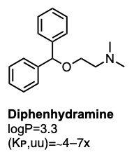
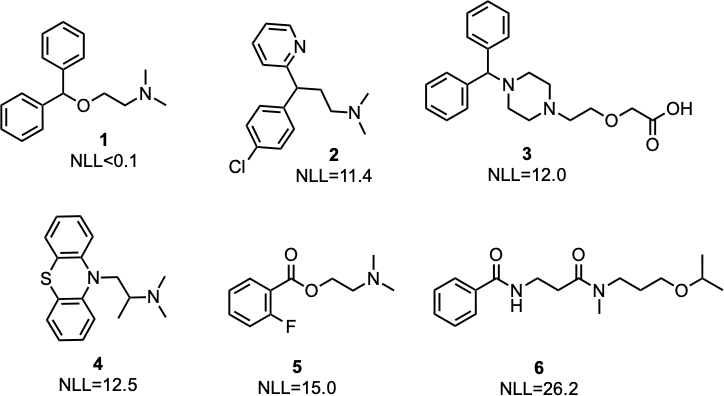
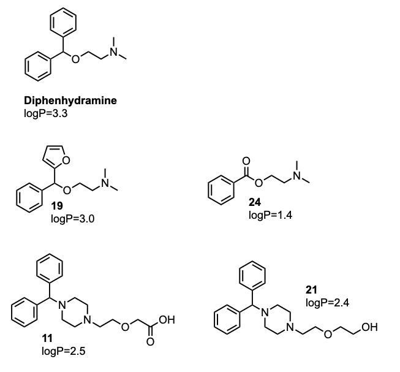

# AI Molecular Generator
Generating Polar Analogues of Diphenhydramine with REINVENT4



## 📖 Introduction

This tutorial demonstrates how to generate *de novo* small-molecule analogues of the classic first-generation antihistamine diphenhydramine. 

Diphenhydramine is quite lipophilic (log P ≈ 3.3), which, along with its pKₐ and high passive permeability, drives strong CNS uptake—total brain levels ~18× plasma in rats, with an unbound‐drug brain/plasma ratio of ∼4–7. 

Our goal is to generate ideas for more polar compounds that are less likely to cross the blood–brain barrier, **reducing CNS side effects**.

---

## 🔧 Prerequisites

- **REINVENT4** installed (see [REINVENT4 installation guide](https://github.com/MolecularAI/Reinvent4))  
- Python 3.8+  
- RDKit  
- A working CUDA-enabled GPU (optional, but recommended)  

---

## 🗂️ Repository Structure

```
.
├── STEP1_pretrain_and_transfer_learning/
├── STEP2_prepare_reference/
├── STEP3_sampling/
├── STEP4_score_and_filter/
├── STEP5_remove_existing/

```

---

## ⚙️ Workflow Overview

1. **Pretrain & Transfer Learning**  
   Fine-tune a REINVENT4 model on an antihistamine-focused dataset to bias it toward relevant chemotypes.

2. **Prepare Reference**  
   Use diphenhydramine as a starting point to bias the network toward closely related molecules.

3. **Sampling**  
   Generate a large pool of candidate analogues.

4. **Scoring & Filtering**  
   Compute predicted log P, CNS-MPO score, and scaffold novelty to select polar, BBB-impermeable scaffolds.

5. **Remove Known Molecules**  
   Eliminate any molecules already present in ChEMBL or PubChem to focus on novel hits.

---

## 🚀 STEP 1: Pretrain & Transfer Learning

### 🔍 What’s Happening in Transfer Learning?

1. **Starting from a Broad Prior**  
   We begin with `reinvent.prior`, a model pretrained on millions of drug-like molecules (from public databases, e.g. ChEMBL, PubChem) (Loeffler et al., 2024). This “prior” knows general medicinal-chemistry grammar: how to stitch atoms into plausible, synthesizable small molecules.

2. **Focusing on Antihistamines**  
   Next, we fine-tune (transfer-learn) that prior using our custom `all_antihistamines.smi` dataset— extracted from PubChem. This biases the model toward the scaffolds, functional groups, and chemotypes characteristic of antihistamines.

3. **Balancing Novelty vs. Familiarity**  
   We don’t want to lose all the broad-chemistry knowledge, nor merely memorize known antihistamines.  
   - Similarity-pair filtering enforces that, during training, generated molecules stay within a Tanimoto window (e.g. 0.7–1.0) of our antihistamine set.  
   - This encourages the model to explore **close analogues** of antihistamines, while the underlying prior still “remembers” general drug-like rules.

4. **Saving a New Specialized Prior**  
   The result is `my_project.prior`—a model that speaks both “general drug-design” (from the original prior) and “antihistamine” (from our fine-tuning).  
   You can now use it to sample entirely new, related scaffolds that retain key H₁-blocker motifs but may improve properties (e.g. polarity, hERG liability).

```bash
cd STEP1_pretrain_and_transfer_learning
reinvent transfer_learning.toml
```

---

## 🔁 STEP 2: Mol2Mol Transfer Learning

In Step 2, we move from simply biasing our SMILES generator toward the general anti-histamines dataset (as in Step 1) to training a conditional model that learns to take diphenhydramine as an input scaffold and produce close analogs. By fine-tuning on pairs of highly similar molecules, the prior becomes specialized for lead optimization and analog design rather than broad, unconstrained sampling.

```bash
cd STEP2_prepare_reference
reinvent mol2mol.toml
```

---

## 🎲 STEP 3: Sampling

There are two possible sampling strategies: 

**Multinomial** sampling picks each next character at random according to the model’s probability distribution (you can “heat up” or “cool down” the randomness via temperature). This produces a diverse set of analogs, which is great for exploring chemical space.

**Beamsearch** deterministically follows the top‐scoring paths to generate the highest‐likelihood SMILES. It yields the most probable analogs but with far less variety.

For lead‐optimization and finding a broad set of possible analogs around diphenhydramine, we will use multinomial sampling (temperature = 1.0) to balance diversity and quality.

The generator to produce a pool of candidates is run by:

```bash
reinvent sampling.toml
```
(The num_smiles parameter was set to 500,000. It took approximately 5 min to generate the molecules on a single NVIDIA RTX A5000 GPU).

**Output NLL (Negative Log-Likelihood)**  
A measure of how “surprised” the model is by a SMILES string—lower NLL means the model finds it more likely, higher NLL means it’s less familiar.

- **Low NLL (< 10):** Highly similar (model confident)  
- **Mid NLL (10 – 15):** Similar to reference  
- **High NLL (> 15):** Diverse

| #  | SMILES (truncated)                       | NLL   | clogP  | Interpretation            |
|----|-------------------------------------------|-------|-------|---------------------------|
| 1  | CN(C)CCOC(c1ccccc1)c1ccccc1               | 0.000 | 4.60  | Identical to reference    |
| 2  | CN(C)CCC(c1ccc(Cl)cc1)c1ccccn1            | 11.40 | 3.10  | Similar                   |
| 3  | O=C(O)COCCN1CCN(C(c2ccccc2)c2ccccc2)CC1   | 12.00 | 0.80  | Similar                   |
| 4  | CC(CN1c2ccccc2Sc2ccccc21)N(C)C            | 12.50 | 4.30  | Similar                   |
| 5  | CN(C)CCOC(=O)c1ccccc1F                    | 15.00 | 2.70  | Diverse                   |
| 6  | CC(C)OCCCN(C)C(=O)CCNC(=O)c1ccccc1        | 26.21 | –0.20 | Very diverse              |



At this stage, one could already plot clogP versus the NLL in Datawarrior, and inspect analogue that are closely related but more polar.

---

## 📊 STEP 4: Scoring & Filtering

By now we’ve generated a large pool of analogs. In Step 4 we:

1. **Filter** out any molecule with a higher log P than diphenhydramine (3.3).  
2. **Score** each remaining hit by combining:
   - **Reverse-normalized NLL** (1 identical → 0 dissimilar)  
   - **Tanimoto similarity** to diphenhydramine (1 identical → 0 dissimilar)  
   The two are averaged to give a **Combined** similarity score (0–1).

```bash
   python score_and_rank.py
```
Some top compounds after filtering and ranking are shown below (IDs 0, 19, 24, 11, 21):

| ID  | SMILES                                               | logP | Similarity | Reverse_NLL | Combined |
|-----|------------------------------------------------------|-----:|-----------:|------------:|---------:|
| 0   | `CN(C)CCOC(c1ccccc1)c1ccccc1`                        | 3.35 |      1.000 |       1.000 |    1.000 |
| 19  | `CN(C)CCOC(c1ccccc1)c1ccco1`                         | 2.95 |      0.604 |       0.613 |    0.609 |
| 24  | `CN(C)CCOC(=O)c1ccccc1`                              | 1.40 |      0.340 |       0.638 |    0.489 |
| 11  | `O=C(O)COCCN1CCN(C(c2ccccc2)c2ccccc2)CC1`             | 2.49 |      0.224 |       0.674 |    0.449 |
| 21  | `OCCOCCN1CCN(C(c2ccccc2)c2ccccc2)CC1`                 | 2.40 |      0.231 |       0.642 |    0.436 |

<p align="center">
  
</p>

## 📈 Results & Next Steps

This approach can be used, for example, to generate thousands of candidates for docking studies, or as part of an active learning loop—by selecting the top-scoring compounds and feeding them back into the model (STEP 1 & 2) to bias future generations toward promising chemotypes.

---

## 📜 Reference

- Loeffler, H.H., He, J., Tibo, A. et al. Reinvent 4: Modern AI–driven generative molecule design. J Cheminform 16, 20 (2024). https://doi.org/10.1186/s13321-024-00812-5
