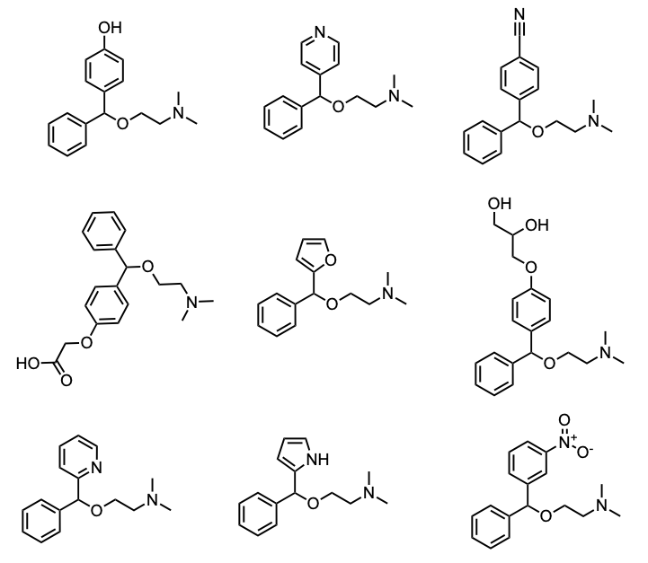

# AI Molecule Generator
In this tutorial, we will teach a recurrent neural network (RNN) to design better molecules. More specifically, we will use REINVENT4 to generate *de novo* polar analogues of Diphenhydramine. 


## 📖 Introduction

Diphenhydramine is a highly lipophilic first-generation antihistamine (log P ≈ 3.3) associated with strong CNS uptake—total brain levels are ∼18× higher than plasma in rats, with an unbound brain/plasma ratio of ∼4–7. In this tutorial, we will bias our analogs toward lower log P to moderate passive diffusion across the BBB. However, ABCB1-mediated efflux is often the dominant mechanism distinguishing non-sedating H₁ antagonists (e.g., cetirizine) from sedating first-generation drugs (Broccatelli et al., 2010). Therefore, future designs might need to combine increased polarity with structural features that enhance P-gp substrate activity to reduce CNS exposure.

---

## 🔧 Prerequisites

- REINVENT4 installed (see [REINVENT4 installation guide](https://github.com/MolecularAI/Reinvent4))  
- Python 3.8+  
- RDKit  
- A working CUDA-enabled GPU (optional, but recommended)  

---

## 🗂️ Repository Structure

```
.
├── STEP1_pretrain_and_transfer_learning/
├── STEP2_prepare_reference/
├── STEP3_sampling/
├── STEP4_score_and_filter/

```

---

## ⚙️ Workflow Overview

1. **Pretrain & Transfer Learning**  
   Fine-tune a REINVENT4 model on an antihistamine-focused dataset to bias it toward relevant chemotypes.

2. **Prepare Reference**  
   Use diphenhydramine as a starting point to bias the network toward closely related molecules.

3. **Sampling**  
   Generate a large pool of candidate analogues.

4. **Scoring & Filtering**  
   Compute predicted log P and similarity to only output polar analogues.

---

## 🚀 STEP 1: Pretrain & Transfer Learning

### 🔍 What’s Happening in Transfer Learning?

1. **Starting from a Broad Prior**  
   We begin with `reinvent.prior`, a model pretrained on millions of drug-like molecules (from public databases, e.g. ChEMBL, PubChem) (Loeffler et al., 2024). This “prior” knows general medicinal chemistry: how to stitch atoms into plausible, synthesizable small molecules.

2. **Focusing on Antihistamines**  
   Next, we fine-tune (transfer-learn) that prior using our custom `all_antihistamines.smi` dataset— extracted from PubChem. This biases the model toward the scaffolds, functional groups, and chemotypes characteristic of antihistamines.

3. **Saving a New Specialized Prior**  
   The result is `my_project.prior`—a model that speaks both “general drug-design” (from the original prior) and “antihistamine” (from our fine-tuning).  
   You can now use it to sample entirely new, related scaffolds that retain key H₁-blocker motifs but may improve properties (e.g. polarity).

```bash
cd STEP1_pretrain_and_transfer_learning
reinvent transfer_learning.toml
```

---

## 🔁 STEP 2: Mol2Mol Transfer Learning

In Step 2, we move from simply biasing our SMILES generator toward the general anti-histamines dataset (as in Step 1) to training a conditional model that learns to take diphenhydramine as an input scaffold and produce close analogs. By fine-tuning on pairs of highly similar molecules, the prior becomes specialized for lead optimization and analog design rather than broad, unconstrained sampling.

```bash
cd STEP2_prepare_reference
reinvent mol2mol.toml
```

---

## 🎲 STEP 3: Sampling

There are two possible sampling strategies: 

**Multinomial** sampling picks each next character at random according to the model’s probability distribution (you can “heat up” or “cool down” the randomness via temperature). This produces a diverse set of analogs, which is great for exploring chemical space.

**Beamsearch** deterministically follows the top‐scoring paths to generate the highest‐likelihood SMILES. It yields the most probable analogs but with far less variety.

For lead‐optimization and finding a broad set of possible analogs around diphenhydramine, we will use multinomial sampling (temperature = 1.0) to balance diversity and quality.

The generator to produce a pool of candidates is run by:

```bash
reinvent sampling.toml
```
(num_smiles was set to 500k, which took about 5 min for generating the molecules on a single NVIDIA A5000 GPU).

**Output NLL (Negative Log-Likelihood)**  
A measure of how “surprised” the model is by a SMILES string—lower NLL means the model finds it more likely, higher NLL means it’s less familiar.

- **Low NLL (< 10):** Highly similar (model confident)  
- **Mid NLL (10 – 15):** Similar to reference  
- **High NLL (> 15):** Diverse

| #  | SMILES (truncated)                       | NLL   | clogP  | Interpretation            |
|----|-------------------------------------------|-------|-------|---------------------------|
| 1  | CN(C)CCOC(c1ccccc1)c1ccccc1               | 0.000 | 4.60  | Identical to reference    |
| 2  | CN(C)CCC(c1ccc(Cl)cc1)c1ccccn1            | 11.40 | 3.10  | Similar                   |
| 3  | O=C(O)COCCN1CCN(C(c2ccccc2)c2ccccc2)CC1   | 12.00 | 0.80  | Similar                   |
| 4  | CC(CN1c2ccccc2Sc2ccccc21)N(C)C            | 12.50 | 4.30  | Similar                   |
| 5  | CN(C)CCOC(=O)c1ccccc1F                    | 15.00 | 2.70  | Diverse                   |
| 6  | CC(C)OCCCN(C)C(=O)CCNC(=O)c1ccccc1        | 26.21 | –0.20 | Very diverse              |


At this stage, one could already plot clogP versus the NLL in Datawarrior, and inspect analogues that are closely related but more polar.

---

## 📊 STEP 4: Scoring & Filtering

By now we’ve generated a large pool of analogs. In Step 4 we:

1. **Filter** out any molecule with a higher log P than diphenhydramine (3.3).  
2. **Score** each remaining hit by combining:
   - **Reverse-normalized NLL** (1 identical → 0 dissimilar)  
   - **Tanimoto similarity** to diphenhydramine (1 identical → 0 dissimilar)  
   The two are averaged to give a **Combined** similarity score (0–1).

```bash
   python score_and_rank.py
```
Top compounds after filtering and ranking are shown below:

| ID  | SMILES                                               | logP | Similarity | Reverse_NLL | Combined |
|-----|------------------------------------------------------|-----:|-----------:|------------:|---------:|
| 0   | `CN(C)CCOC(c1ccccc1)c1ccccc1`                        | 3.35 |      1.000 |       1.000 |    1.000 |
| 19  | `CN(C)CCOC(c1ccccc1)c1ccco1`                         | 2.95 |      0.604 |       0.613 |    0.609 |
| 24  | `CN(C)CCOC(=O)c1ccccc1`                              | 1.40 |      0.340 |       0.638 |    0.489 |
| 11  | `O=C(O)COCCN1CCN(C(c2ccccc2)c2ccccc2)CC1`             | 2.49 |      0.224 |       0.674 |    0.449 |
| 21  | `OCCOCCN1CCN(C(c2ccccc2)c2ccccc2)CC1`                 | 2.40 |      0.231 |       0.642 |    0.436 |

<p align="center">
  
</p>

## 📈 Results & Next Steps

This approach can be used to generate thousands of candidates for docking studies. Alternatively, it could be part of an active learning loop—by selecting the top-scoring compounds and feeding them back into an improved neural net (STEP 1 & 2) to bias future generations toward promising chemotypes.

---

## 🔄 Revision: Known Antihistamine Hits

Inspecting the sampled structures from the fine-tuned model, two familiar scaffolds appear:

- Compound **11** and **21** are almost identical to [**Cetirizine**](https://en.wikipedia.org/wiki/Cetirizine) (Zyrtec), and [**Hydroxyzine**](https://en.wikipedia.org/wiki/Hydroxyzine), respectively—both obtained by adding a single para-chloro group.

Both Cetirizine and Hydroxyzine were included in `all_antihistamines.smi` (STEP 2), so it’s not surprising that the model learned to reproduce compounds that are very similar.

Interestingly, compound **21** is also known, but was not in the training set. It is [**Decloxizine**](https://pubchem.ncbi.nlm.nih.gov/compound/Decloxizine)—a known H₁-blocker belonging to 2nd class anti-histamines. In a clinical study in the 70s, it was was reported to have no CNS side-effects versus placebo.

To generate more original compounds, one could consider skiping **STEP 2** entirely, and sample directly from the general `reinvent.prior`. Below are some examples obtained in this way:

<p align="center">
  
</p>

---

## 📜 Reference

- Loeffler, H.H., He, J., Tibo, A. et al. Reinvent 4: Modern AI–driven generative molecule design. *J Cheminform* **16**, 20 (2024). https://doi.org/10.1186/s13321-024-00812-5  
- Broccatelli, F., Carosati, E., Cruciani, G., Oprea, T.I. Transporter-mediated efflux influences CNS side effects: ABCB1, from antitarget to target. *Mol Inform* **29**(1–2), 16–26 (2010). https://doi.org/10.1002/minf.200900075


